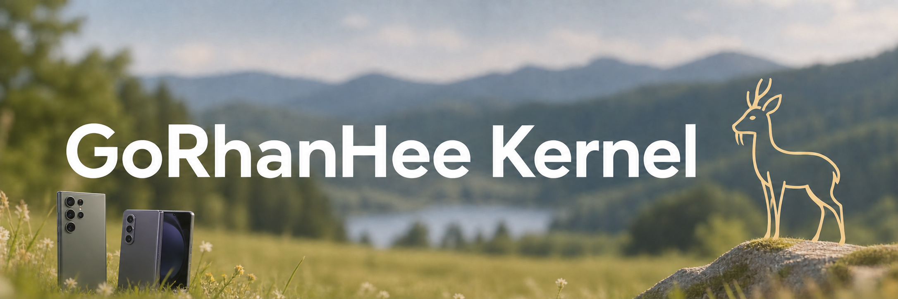

# GoRhanHee Kernel

<p align="center">
  
</p>

## ⚠️ Disclaimer

- Designed for Samsung stock One UI firmware.
- One UI-based custom ROMs may be incompatible; UN1CA has been tested and confirmed working.
- AOSP-based ROMs are not supported.

## 📱 Supported Devices

| Codename | Device | Status |
| --- | --- | --- |
| `dm1q` | Galaxy S23 | ✅ Supported |
| `dm2q` | Galaxy S23+ | ✅ Supported |
| `dm3q` | Galaxy S23 Ultra | ✅ Supported |
| `q5q` | Galaxy Z Fold5 | ✅ Supported |
| `b5q` | Galaxy Z Flip5 | ❌ Not supported |

Global and international variants using the same device codename are supported when firmware and partition layouts match.

The build script contains a `b5q` profile for development, but Galaxy Z Flip5 is currently excluded from supported devices.

## ✨ Features

- The `normal` build mode does not include KernelSU-Next or SUSFS.
- The `susfs` build mode adds KernelSU-Next and SUSFS 2.2.0 for Android 13 / Linux 5.15.
- Baseband Guard monitors unauthorized writes to protected partition devices.
- DroidSpaces support enables Linux containers through namespaces, IPC, netfilter, and matching DLKM modules.
- NTSync provides kernel synchronization primitives for Wine, Winlator, and GameHub.
- BBRv3 with TCP PLB is available for runtime network congestion control.
- FQ, FQ-CoDel, CAKE, PIE, NAT, IP sets, and IPv6 masquerading are enabled for network policy flexibility.
- Memory paths include optimized memset, memcpy, memcmp, page clearing, alignment, and cache-pressure tuning.
- Scheduler paths include CPU scan-order, cache-hot-buddy, and cpufreq minimum-frequency tuning.
- F2FS and ext4 include garbage-collection, congestion, fsync, and journal-commit tuning.
- Power management includes wakelock, alarmtimer, freeze-timeout, s2idle, and PCI PME wakeup tuning.
- Repetitive IRQ, healthd, logd, and dashd kernel messages are reduced.

## 🔨 Build

```sh
git clone https://github.com/GoRhanHee/android_kernel_samsung_sm8550.git
cd android_kernel_samsung_sm8550
git submodule update --init --recursive
```

Supported build targets:

```sh
./build.sh dm3q normal
./build.sh dm3q susfs
./build.sh dm1q normal
./build.sh dm2q susfs
./build.sh q5q susfs
```

The second argument selects the kernel mode and defaults to `normal` when omitted. `normal` keeps the common project feature patches but excludes KernelSU-Next/SUSFS. `susfs` imports the pinned KernelSU-Next revision, applies the two patches under `patches/susfs/`, and merges `custom_defconfigs/ksu_defconfig` followed by `custom_defconfigs/susfs_defconfig`. All source patches are reverted when the build exits.

The build flow selects the device profile, applies the common feature patches, merges the custom defconfig, builds the kernel and matching vendor modules, then packages `Image` and the matching boot/DLKM images in an AnyKernel3 ZIP.

## 📦 Output & AnyKernel3 Installation

Typical output:

```text
out/<model>/msm-kalama-kalama-gki-<mode>/
```

Main artifacts:

```text
Image
vendor_boot.img
vendor_dlkm.img
system_dlkm.img
GoRhanHee_Kernel-kalama-<model>-<mode>-AnyKernel3.zip
```

`<mode>` is `normal` or `susfs`; the separate output paths allow both variants to remain available at the same time.

- Flash only to the matching device and firmware family.
- Keep the four images together; `vendor_dlkm.img` and `system_dlkm.img` are matched to the selected device.
- Keep stock images available for recovery.
- The Flip5 (`b5q`) build is not currently supported.

### AnyKernel3 Installation

Flash the `-AnyKernel3.zip` package from a custom recovery or another AnyKernel3-compatible flasher. The ZIP contains the AK3 recovery shell, `Image`, `vendor_boot.img`, `vendor_dlkm.img`, and `system_dlkm.img`; the shell repacks and flashes the active `boot` partition and then flashes the three accompanying partitions.

The bootloader must be unlocked, and the device must use a recovery/flasher that supports AnyKernel3 update ZIPs. Samsung Download Mode/Odin is not used by this package. Keep a stock backup available because flashing is sequential and has no rollback.

## 📚 Credits

- [Android Common Kernel](https://android.googlesource.com/kernel/common/) — Android 13 / Linux 5.15 GKI base.
- [Qualcomm MSM Kernel](https://git.codelinaro.org/clo/la/kernel/msm-5.15) — SM8550 / Kalama platform source.
- [Samsung Open Source Release Center](https://opensource.samsung.com/) — Samsung device kernel source reference.
- [KernelSU-Next](https://github.com/KernelSU-Next/KernelSU-Next) — KernelSU-Next root integration.
- [SUSFS for KernelSU](https://gitlab.com/simonpunk/susfs4ksu/-/tree/gki-android13-5.15) — Android 13 / Linux 5.15 kernel integration reference.
- [KernelSU-Next SUSFS reference patch](https://github.com/xfwdrev/android_kernel_samsung_b4q/blob/sixteen/patches/0001-Enable-SuSFS-2.2.0-KSU-Next.patch) — KernelSU-Next-side SUSFS 2.2.0 integration reference.
- [AnyKernel3](https://github.com/osm0sis/AnyKernel3) — flashable kernel ZIP framework.
- [Baseband Guard](https://github.com/vc-teahouse/Baseband-guard) — Protected partition write monitoring.
- [DroidSpaces OSS](https://github.com/ravindu644/Droidspaces-OSS) — Linux container support reference.
- [Google BBR](https://github.com/google/bbr) — BBR congestion-control reference.
- [WildKernels](https://github.com/WildKernels) — Kernel optimization and feature patch reference.
